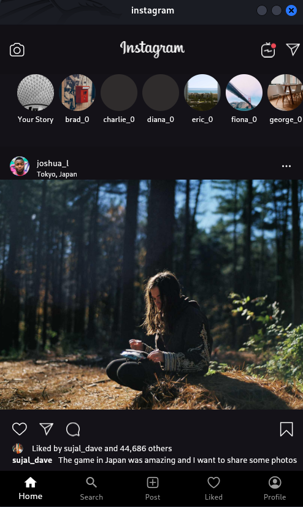
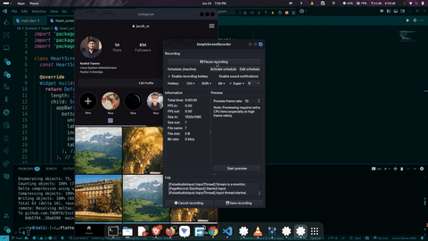

# 📸 Instagram Clone in Flutter (with Random Image Feed)

This is a lightweight **Instagram clone built in Flutter**, featuring a scrollable feed of images fetched randomly using the free [Picsum Photos API](https://picsum.photos/).

---

## 🖼️ Preview



---

## 🎥 Demo

<p align="center">
  
</p>


<!-- Optional: Embed with HTML (may not work on GitHub.com) -->
<!-- 
<video width="100%" controls>
  <source src="assets/insta_demo.mkv" type="video/x-matroska">
  Your browser does not support the video tag.
</video>
-->

---

## 🚀 Features

- Instagram-style scrollable feed using Flutter
- Fetches and displays random images via Picsum API
- Responsive and clean UI design
- Demo video and preview image included in `assets/`

---

## 🛠️ Getting Started

```bash
git clone https://github.com/yourusername/flutter-instagram-clone.git
cd flutter-instagram-clone
flutter pub get
flutter run
